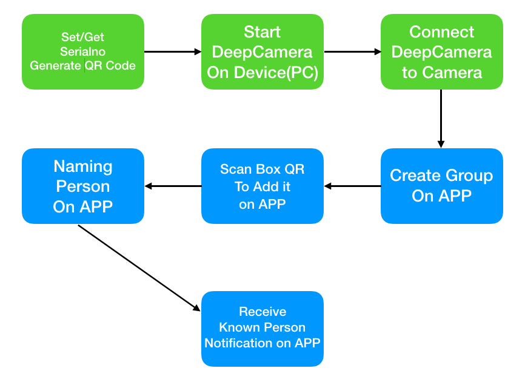
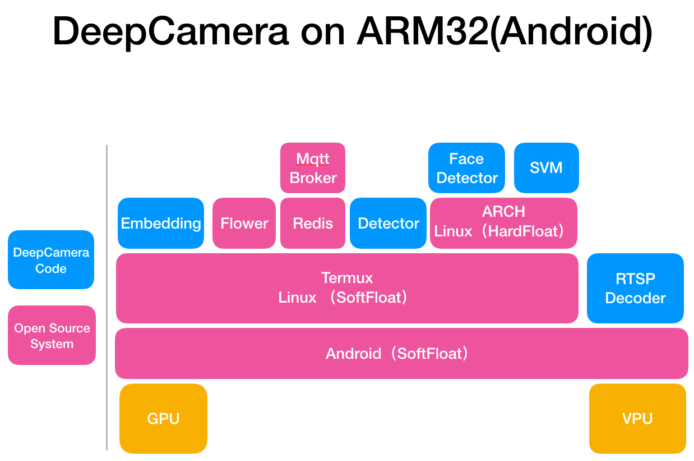
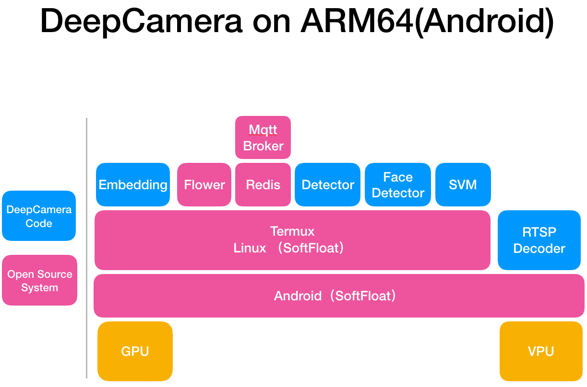
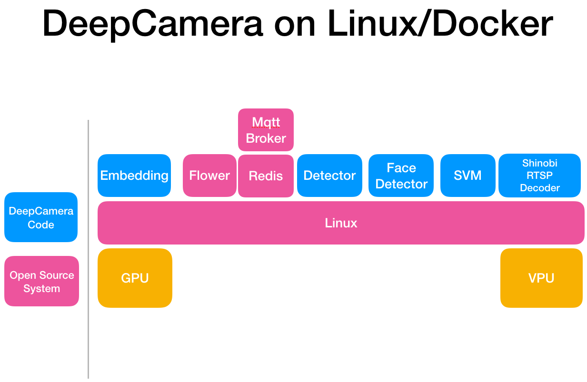

# What's SharpAI DeepCamera
Full stack system for the deep learning edge computing devices, espeicailly set-up-box off the shell with image burning or Android apk installation.

## Data labeling on Mobile, no data scientist involed
## Automatically train/deploy model for edge device(Embedded System)
## Power efficient, Easy scalable, Production ready


# Feature List
- [x] High accurate Face Recognition
- [x] Face Detection
- [x] Inference on ARM Mali GPU
- [x] Support Android TF Lite(GPU/CPU/NPU)
- [x] Support open source embedded linux
- [x] Control from mobile application
- [x] Management System for devices
- [x] Push Notification to Mobile Device
- [x] Object Detection
- [x] Distributed System based on celery
- [x] Plugin to process video by Shinobi CCTV
- [x] Application on Android to decode video with hw acc
- [x] Motion Detection with Android GPU
- [x] Lable and train from Mobile to Edge Device

# Supported Device
- [x] X86 (Linux/Ubuntu, Mac OS X, Windows(not tested) through Docker)
- [x] Rockchip RK3399 (Linux, set-up-box H96 Max)
- [x] Rockchip RK3288 (Android, set-up-box)
- [x] Samsung 7420 (Android, Mobile)
- [x] Rockchip RK3399 (Android RockPro64 doc release soon)
- [x] Linux/Android Has OpenCL (TVM Supported)
- [ ] Raspberry Pi [WIP](docs/RunOnRaspberryPi.md)

# Supported Camera
- [x] Dahua Camera
- [x] Hikvision Camera
- [x] Shinobi CCTV Supported Devices
- [x] Screen Captured from Android Camera preview application

# Slack Channel
[Click to join sharpai slack channel](https://sharpai-invite-automation.herokuapp.com/)

# Demo


# Purchase Dev Kit for easily startup
Run from code is time consuming task even with experts' supporting, we are considering to provide full set of development kit to easy the setup effort you may face to. 
[Please thumb up if you want one](https://github.com/SharpAI/DeepCamera/issues/8)
### How it works from end user's point of view, green parts are done if using Dev Kit


# How to Run DeepCamera From Source Code

## Generate/Get Serial No
### Android
After install Launcher(Modified Termux), the serial_no will be placed:
`/data/data/com.termux/files/home/.ro_serialno`
### Linux
Get your Mac Address(1e:20:34:10:24:21)
```
cd DeepCamera
echo 1e2034102421 > docker/workaipython/ro_serialno
```
### Then generate text type QR code with serial_no you just got

## How to Run DeepCamera on Edge Device

### [Run on Rockchip RK3399 with linux/docker](https://github.com/SharpAI/facebox_sdk)
### [Run on Rockchip RK3288 with Android 5.1](docs/RunOnRK3288.md)
### Run on X86 Laptop Docker
#### Use prebuilt docker images
```
git clone https://github.com/SharpAI/DeepCamera
cd DeepCamera/docker
docker-compose -f docker-compose-x86.yml up
```
Then you need to follow [Shinobi's document](https://shinobi.video) to add camera.   
http://ip:8080  
Default username/password:   
username: user@sharpaibox.com  
password: SharpAI2018    
#### Build docker images on your local machine
```
git clone https://github.com/SharpAI/ImageBuilder-DeepLearning -b android_porting
cd ImageBuilder-DeepLearning/Docker-DeepEye/workai/
./build_x86_dockers.sh
```

Then run DeepCamera, will use local docker images

```
git clone https://github.com/SharpAI/DeepCamera
cd DeepCamera/docker
docker-compose -f docker-compose-x86.yml up
```
### Run on RockPro64 Android 7.1
coming soon
### Run on Raspberry Pi
coming soon
## [How to configure on Mobile APP](https://github.com/SharpAI/mobile_app_server/blob/android_porting/README.md)
## [How to deploy server on your server](https://github.com/SharpAI/mobile_app_server/issues/1)
# Call For Help
- [ ] Documents, A LOT OF DOCUMENTS, we already deploy our deep camera in industry leading company but we don't have extra resource to build up community friendly documents.
- [ ] Tutorial on youtube, we can build up some of them, only if with your help, we can success together.
- [ ] Translation, we did deploy our production in China, much of our resource is in Chinese, need your help to translate, especially the Mobile APP built with Meteor https://github.com/SharpAI/mobile_app_server  (need i18n selection based on system language)
- [ ] Remove unused code/project in https://github.com/SharpAI/mobile_app_server
- [ ] PR, more than welcome, anything :)
- [ ] Meetup hosts, in Silicon Valley







 
# APIs doc for app server
[Click to see APIs document](https://github.com/SharpAI/mobile_app_server/tree/android_porting/rest_api_sdk)

# App User Guide
[Click for user guide](https://github.com/SharpAI/mobile_app_server/blob/android_porting/README.md)
