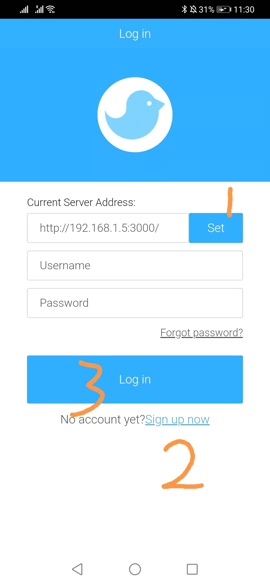
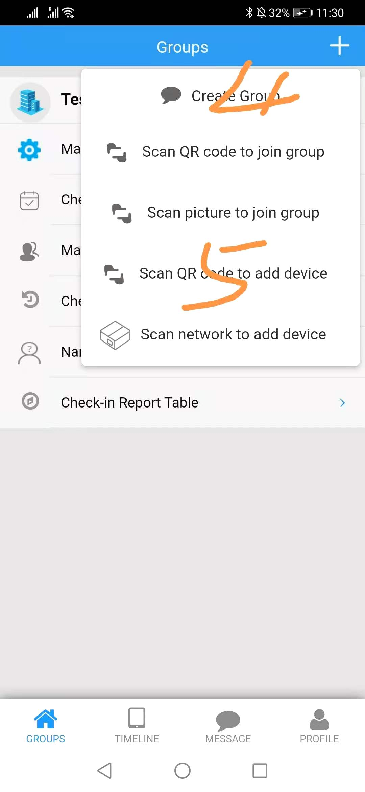
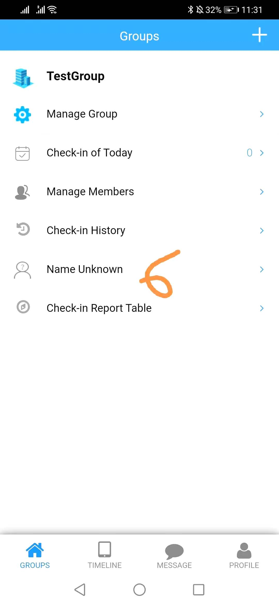
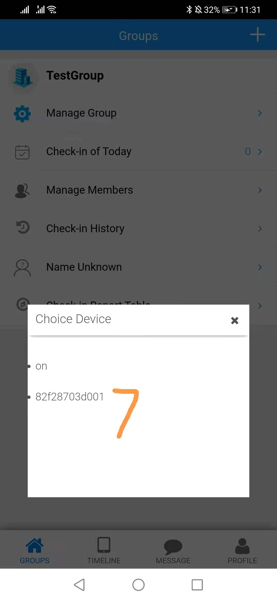
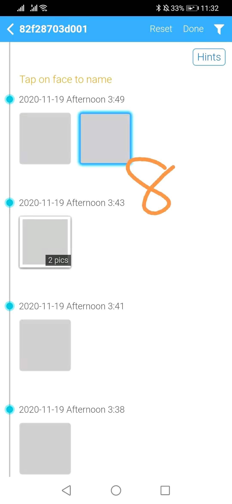
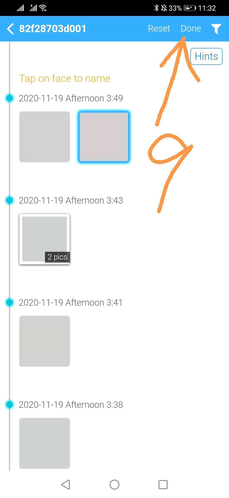
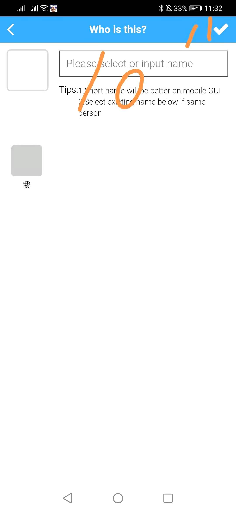
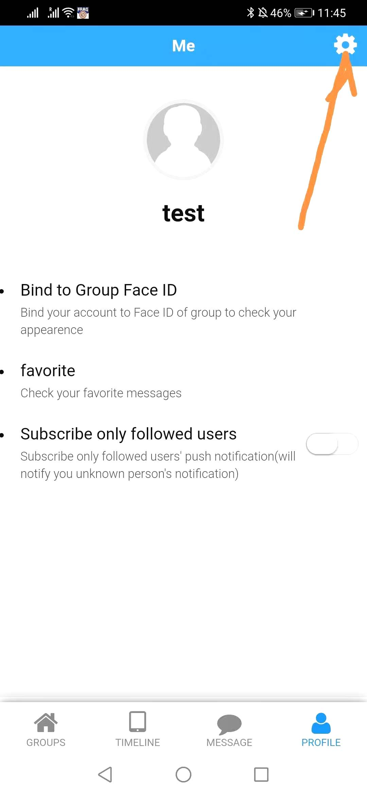
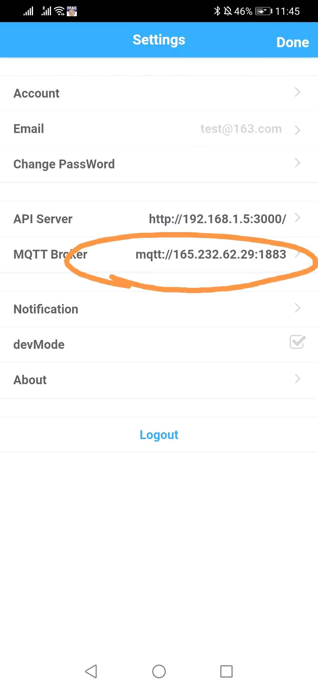

# What's SharpAI DeepCamera [](https://travis-ci.org/SharpAI/DeepCamera)
SharpAI is open source stack for machine learning engineering with private deployment and AutoML for edge computing.  DeepCamera is application of SharpAI designed for connect computer vision model to surveillance camera. Developers can run same code on Raspberry Pi/Android/PC/AWS to boost your AI production development.


## DeepCamera Architecture


## Feature List
- [x] High accurate Face Recognition
- [x] Face Detection
- [x] Inference on ARM Mali GPU
- [x] Support Android TF Lite(GPU/CPU/NPU)
- [x] Support open source embedded linux
- [x] Control from mobile application
- [x] Management System for devices
- [x] Push Notification to Mobile Device
- [x] Object Detection
- [x] Distributed System based on celery
- [x] Plugin to process video by Shinobi CCTV
- [x] Application on Android to decode video with hw acc
- [x] Motion Detection with Android GPU
- [x] Lable and train from Mobile to Edge Device
- [x] Native raspberry pi camera support
- [x] Labelling server and application is down, need BYOD document [API server repo](https://github.com/SharpAI/ApiServer)
- [x] Image upload to AWS or on premise AWS compatiable server(MINIO)

## Demo


# Get Started
## Prepare System

Please install 32bit system (official raspbian)

## Prepare Camera

Now you need to enable camera support using the raspi-config program you will have used when you first set up your Raspberry Pi. Use the cursor keys to select and open Interfacing Options, and then select Camera and follow the prompt to enable the camera.
https://www.raspberrypi.org/documentation/configuration/camera.md

## Prepare Docker
```
sudo curl -sSL https://get.docker.com | sh
```
## on Raspberry Pi 3/4

### Get source code
```
git clone https://github.com/SharpAI/DeepCamera
```

### Configure

edit configuration on Pi, change following environment variables to PC/Server/Cloud ip address:

#### [aws.env](../docker/aws.env)
AWS_END_POINT='<Server_IP>'  
AWS_READABLE_PREFIX='http://<Server_IP>:9000/storage/'

#### [servers.env](../docker/servers.env)
MQTT_BROKER_ADDRESS=<Server_IP>  
API_SERVER_ADDRESS=<Server_IP>
### Start DeepCamera
```
cd DeepCamera  
./run-on-rpi.sh start
```

## on PC/Server/Cloud
```
git clone https://github.com/SharpAI/DeepCamera
cd DeepCamera
./start-cloud.sh start
```
You need ip address of private cloud server on next step (replace ip address to <Server_IP> on next step).  
If you don't want to setup your own server for now, a test server can be used for evaluation, the ip address of test server is 165.232.62.29

## Use Mobile APP to receive recognition result on Raspberry Pi
### Get device serial number
```
cat docker/workaipython/ro_serialno 
82f28703d001
```
`82f28703d001` is device ID.    
Generate QRCode of device ID

### Download and install [SharpAI Mobile APP](https://github.com/SharpAI/SharpAIMobileApp/releases/download/3.0.1.3/debug.apk)

### Configure on Mobile APP


## Connect to Surveillance Camera through Open Source NVR
Shinobi login page(device_ip:8080):   
username: user@sharpaibox.com  
password: SharpAI2018

Change IP configuration and camera url on the page. [Detail information](https://github.com/SharpAI/DeepCamera/blob/master/docs/shinobi.md)   
If you are using other camera support streaming, please check [The Shinobi NVR's document](https://shinobi.video)

## Develop your own Application GUI with DeepCamera
### Get device serial number
```
cat docker/workaipython/ro_serialno 
82f28703d001
```
`82f28703d001` is device ID
### Create User on API Server
REST API:
```
curl -X POST -H "Content-type: application/json" http://localhost:3000/api/v1/sign-up -d '{"username": "test11", "email": "xxxx@xxx.xx", "password": "xxxxxx"}'
```
Response:
```
{
  "success": true
}
```
### Get Token of created user
REST API:
```
curl -X POST -H "Content-type: application/json" http://localhost:3000/api/v1/login/ -d '{"username": "test11", "email": "xxxx@xxx.xx", "password": "123456"}'
```
Response:
```
{
  "status": "success",
  "data": {
    "authToken": "t6QsPaU3VdbfUQMkNIf6I3MDtox29WLrPJRAKkOCfpc",
    "userId": "tiK8RYG87sGJAErdB"
  }
}
```
### Create Group on API Server
Rest API:

Fill in `X-Auth-Token` and `X-User-Id` in previous response.
```
curl -X POST -H "X-Auth-Token: t6QsPaU3VdbfUQMkNIf6I3MDtox29WLrPJRAKkOCfpc" -H "X-User-Id: tiK8RYG87sGJAErdB" http://localhost:3000/api/v1/groups -d "name=group01"
```
Response:
```
{
  "groupId": "e309ff8c7a3a8ceb4011e86e"
}
```
### Add device to Group on API Server
REST API:
Replace `X-Auth-Token` and `X-User-Id`.
Replace group id in requesting URL: http://localhost:3000/api/v1/groups/`e309ff8c7a3a8ceb4011e86e`/devices
```
curl -X POST -H "X-Auth-Token: t6QsPaU3VdbfUQMkNIf6I3MDtox29WLrPJRAKkOCfpc" -H "X-User-Id: tiK8RYG87sGJAErdB" -H "Content-type: application/json" http://localhost:3000/api/v1/groups/e309ff8c7a3a8ceb4011e86e/devices -d '{"uuid": "82f28703d001", "deviceName": "testDevice", "name":"testdevice","type": "inout"}'
```
Response:
```
{
  "success": true
}
```

Then restart DeepCamera service.
### API Server document can be found here: [SharpAI/ApiServer](https://github.com/SharpAI/ApiServer#full-api-document)

### You can also develop/debug code on your PC [How to run DeepCamera On PC](docs/develop_on_pc.md)

## Commercial Support
### Slack
[Click to join sharpai slack channel](https://sharpai-invite-automation.herokuapp.com/)

## [Contributions](Contributions.md)
