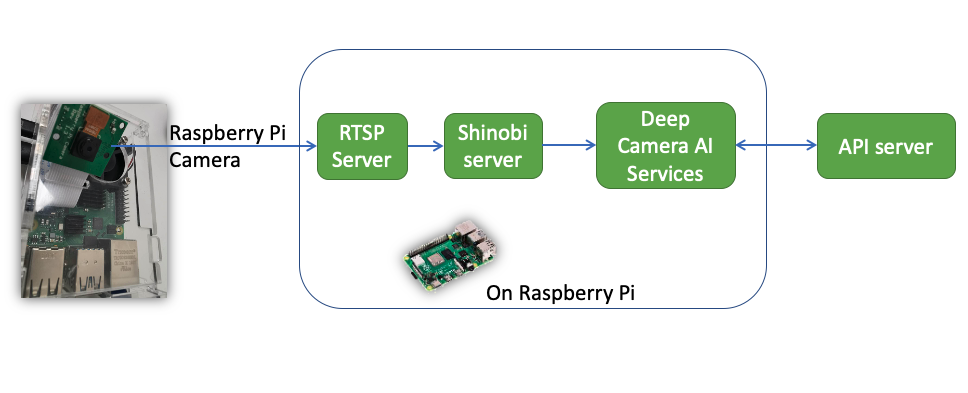

# What's SharpAI DeepCamera
This is a unique repository in many ways. It’s a deep learning model open sourced to protect your privacy. The entire DeepCamera concept is based on automated machine learning (AutoML). So you don’t even need any programming experience to train a new model.

DeepCamera works on IOT devices such as Raspberry Pi and Android devices.
You can integrate the code with surveillance cameras as well. There’s a LOT you can do with DeepCamera’s code, including:

- Face recognition
- Face Detection
- Control from mobile application
- Object detection
- Motion detection
- Human ReID (Recognition based on human shape)

And a whole host of other things. Building your own AI-powered model has never been this easy!

## Commercial Support

### Slack
[Click to join sharpai slack channel](https://sharpai-invite-automation.herokuapp.com/)

## Feature List
- [x] High accurate Face Recognition
- [x] Face Detection
- [x] Inference on ARM Mali GPU
- [x] Support Android TF Lite(GPU/CPU/NPU)
- [x] Support open source embedded linux
- [x] Control from mobile application
- [x] Management System for devices
- [x] Push Notification to Mobile Device
- [x] Object Detection
- [x] Distributed System based on celery
- [x] Plugin to process video by Shinobi CCTV
- [x] Application on Android to decode video with hw acc
- [x] Motion Detection with Android GPU
- [x] Lable and train from Mobile to Edge Device

## Supported/tested Device
- [x] MediaTek MTK6797 (Android, Mobile/Tablet)
- [x] Huawei Kirin 960/970/980 （Android, Mobile/Tablet)
- [x] Samsung 7420 (Android, Mobile)
- [x] Raspberry Pi
- [x] X86 (Linux/Ubuntu, Mac OS X, Windows(not tested) through Docker)
- [x] Rockchip RK3399 (Linux, set-up-box H96 Max)
- [x] Rockchip RK3399 (Android, RockPro64)
- [x] Rockchip RK3288 (Android, set-up-box)
- [x] ARM 64bit devices

## Supported Camera
- [x] Dahua Camera
- [x] Hikvision Camera
- [x] Shinobi CCTV Supported Devices
- [x] Screen Captured from Android Camera preview application

## Demo

## Todo
- [x] Native raspberry pi camera support
- [ ] Macbook Pro iSight camera support
- [ ] Labelling server and application is down, need BYOD document [API server repo](https://github.com/SharpAI/ApiServer)
- [ ] Image upload is not working(was using Aliyun), need change to upload to server itself

## How DeepCamera works on Raspberry Pi with Native Camera

### [How to run DeepCamera on Raspberry Pi 4](docs/RUN_ON_PI_V2.md)
### [API server API document](https://github.com/SharpAI/ApiServer#app-server-api)

## It is even possible to integrate with your Surveilance Camera 

### Through Shinobi (if you install DeepCamera through Docker)
Then you need to follow [Shinobi's document](https://shinobi.video) to add camera. or [click to see our tutorial](https://github.com/SharpAI/DeepCamera/blob/master/docs/shinobi.md)

Shinobi login page(device_ip:8080):   
username: user@sharpaibox.com  
password: SharpAI2018 

You can also [turn Mac Camera into RTSP camera(not tested)](https://www.tribler.org/MacWebcam/)

## Contributions
This project contains source code or library dependencies from the follow projects:
* Tensorflow available at: https://github.com/tensorflow/tensorflow Apache License 2.0
* MXNet available at: https://github.com/apache/incubator-mxnet Apache License 2.0
* TVM available at: https://github.com/dmlc/tvm Apache License 2.0
* Shinobi project available at: https://gitlab.com/Shinobi-Systems/Shinobi/ Copyright (c) 2018 Shinobi Systems
* Termux project available at: https://github.com/termux/termux-app GPLv3/Apache License 2.0
* Insightface project available at: https://github.com/deepinsight/insightface MIT License
* Easyrs project available at: https://github.com/silvaren/easyrs MIT License
* Nodejs: https://nodejs.org Copyright Node.js contributors. All rights reserved.
* Python: https://www.python.org Python 2.7 license
* Gcc for termux with fortran scipy etc: https://github.com/its-pointless/gcc_termux
* RembrandtAndroid project available at https://github.com/imgly/RembrandtAndroid
* Great English-writing introduction on [analyticsvidhya](https://www.analyticsvidhya.com/blog/2019/04/top-5-machine-learning-github-reddit/)
