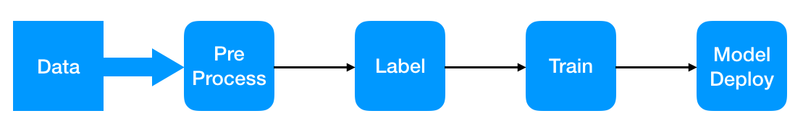
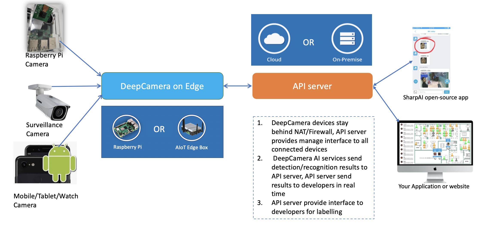

# What's SharpAI DeepCamera [](https://travis-ci.org/SharpAI/DeepCamera)
SharpAI is open source stack for machine learning engineering with private deployment and AutoML for edge computing.  DeepCamera is application of SharpAI designed for connect computer vision model to surveillance camera. Developers can run same code on Raspberry Pi/Android/PC/AWS to boost your AI production development.


## DeepCamera Architecture


## Feature List
- [x] High accurate Face Recognition
- [x] Face Detection
- [x] Inference on ARM Mali GPU
- [x] Support Android TF Lite(GPU/CPU/NPU)
- [x] Support open source embedded linux
- [x] Control from mobile application
- [x] Management System for devices
- [x] Push Notification to Mobile Device
- [x] Object Detection
- [x] Distributed System based on celery
- [x] Plugin to process video by Shinobi CCTV
- [x] Application on Android to decode video with hw acc
- [x] Motion Detection with Android GPU
- [x] Lable and train from Mobile to Edge Device
- [x] Native raspberry pi camera support
- [x] Labelling server and application is down, need BYOD document [API server repo](https://github.com/SharpAI/ApiServer)
- [x] Image upload to AWS or on premise AWS compatiable server(MINIO)

## Commercial Support
### Slack
[Click to join sharpai slack channel](https://sharpai-invite-automation.herokuapp.com/)

## Demo


# Get Started

## On X86 Linux
1. Install Docker
```
sudo curl -sSL https://get.docker.com | sh
```
2. Install Docker-compose
```
sudo curl -L "https://github.com/docker/compose/releases/download/1.27.4/docker-compose-$(uname -s)-$(uname -m)" -o /usr/local/bin/docker-compose
sudo chmod +x /usr/local/bin/docker-compose
```
3. Get source code
```
git clone https://github.com/SharpAI/DeepCamera
```
4. Start container
```
cd DeepCamera/
./run-on-linux.sh start
```
## On OSX
1. Install Docker
[Install Docker Desktop on Mac(Offical)](https://docs.docker.com/docker-for-mac/install/)
2. Get source code
```
git clone https://github.com/SharpAI/DeepCamera
```
3. Start container
```
cd DeepCamera/
./run-on-mac.sh start
```

## [On Raspberry Pi 3B+/4B](docs/RUN_ON_PI_V2.md)

## Connect Streaming
### Through Open Source NVR

Shinobi login page(device_ip:8080):   
username: user@sharpaibox.com  
password: SharpAI2018 

Change IP configuration and camera url on the page. [Detail information](https://github.com/SharpAI/DeepCamera/blob/master/docs/shinobi.md)   
If you are using other camera support streaming, please check [The Shinobi NVR's document](https://shinobi.video)  [Supported Devices](docs/Supported_Devices.md)

## Connect DeepCamera to API Server

### Get device serial number
```
cat docker/workaipython/ro_serialno 
82f28703d001
```
`82f28703d001` is device ID
### Create User on API Server
REST API:
```
curl -X POST -H "Content-type: application/json" http://localhost:3000/api/v1/sign-up -d '{"username": "test11", "email": "xxxx@xxx.xx", "password": "xxxxxx"}'
```
Response:
```
{
  "success": true
}
```
### Get Token of created user
REST API:
```
curl -X POST -H "Content-type: application/json" http://localhost:3000/api/v1/login/ -d '{"username": "test11", "email": "xxxx@xxx.xx", "password": "123456"}'
```
Response:
```
{
  "status": "success",
  "data": {
    "authToken": "t6QsPaU3VdbfUQMkNIf6I3MDtox29WLrPJRAKkOCfpc",
    "userId": "tiK8RYG87sGJAErdB"
  }
}
```
### Create Group on API Server
Rest API:

Fill in `X-Auth-Token` and `X-User-Id` in previous response.
```
curl -X POST -H "X-Auth-Token: t6QsPaU3VdbfUQMkNIf6I3MDtox29WLrPJRAKkOCfpc" -H "X-User-Id: tiK8RYG87sGJAErdB" http://localhost:3000/api/v1/groups -d "name=group01"
```
Response:
```
{
  "groupId": "e309ff8c7a3a8ceb4011e86e"
}
```
### Add device to Group on API Server
REST API:
Replace `X-Auth-Token` and `X-User-Id`.
Replace group id in requesting URL: http://localhost:3000/api/v1/groups/`e309ff8c7a3a8ceb4011e86e`/devices
```
curl -X POST -H "X-Auth-Token: t6QsPaU3VdbfUQMkNIf6I3MDtox29WLrPJRAKkOCfpc" -H "X-User-Id: tiK8RYG87sGJAErdB" -H "Content-type: application/json" http://localhost:3000/api/v1/groups/e309ff8c7a3a8ceb4011e86e/devices -d '{"uuid": "82f28703d001", "deviceName": "testDevice", "name":"testdevice","type": "inout"}'
```
Response:
```
{
  "success": true
}
```

Then restart DeepCamera service.

## Rebuild Mobile App to connect to your own API Server(Doc WIP)
### Clone https://github.com/SharpAI/ApiServer
### Setup your own travis service for CI (to build your own APK on travis)
### Setup your own sign keystore, setup your own Environment
### Trigger build

## [Labelling and receive message sent from DeepCamera with Face Detection/Recognition result](https://github.com/SharpAI/SharpAIMobileApp#how-to-use-sharpai-app)

### API Server document can be found here: [SharpAI/ApiServer](https://github.com/SharpAI/ApiServer#full-api-document)

## Contributions
This project contains source code or library dependencies from the follow projects:
* Tensorflow available at: https://github.com/tensorflow/tensorflow Apache License 2.0
* MXNet available at: https://github.com/apache/incubator-mxnet Apache License 2.0
* TVM available at: https://github.com/dmlc/tvm Apache License 2.0
* Shinobi project available at: https://gitlab.com/Shinobi-Systems/Shinobi/ Copyright (c) 2018 Shinobi Systems
* Termux project available at: https://github.com/termux/termux-app GPLv3/Apache License 2.0
* Insightface project available at: https://github.com/deepinsight/insightface MIT License
* Easyrs project available at: https://github.com/silvaren/easyrs MIT License
* Nodejs: https://nodejs.org Copyright Node.js contributors. All rights reserved.
* Python: https://www.python.org Python 2.7 license
* Gcc for termux with fortran scipy etc: https://github.com/its-pointless/gcc_termux
* RembrandtAndroid project available at https://github.com/imgly/RembrandtAndroid
* Great English-writing introduction on [analyticsvidhya](https://www.analyticsvidhya.com/blog/2019/04/top-5-machine-learning-github-reddit/)
