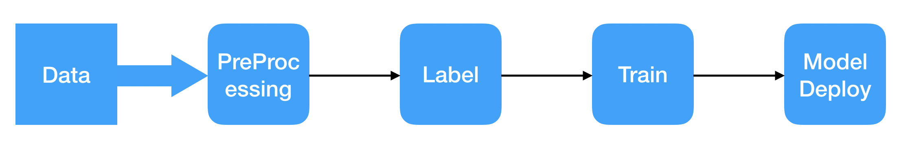

# What's SharpAI
Full stack system for the deep learning edge computing devices, espeicailly set-up-box off the shell with image burning or Android apk installation.

## Data labeling on Mobile, no data scientist involed
## Automatically train/deploy model for edge device(Embedded System)
## Power efficient, Easy scalable, Production ready



# Feature List
- [x] High accurate Face Recognition
- [x] Face Detection
- [x] Inference on ARM Mali GPU
- [x] Support Android TF Lite(GPU/CPU/NPU)
- [x] Support open source embedded linux
- [x] Control from mobile application
- [x] Management System for devices
- [x] Push Notification to Mobile Device
- [x] Object Detection
- [x] Distributed System based on celery
- [x] Plugin to process video by Shinobi CCTV
- [x] Application on Android to decode video with hw acc
- [x] Motion Detection with Android GPU
- [x] Lable and train from Mobile to Edge Device

# Supported Device
- [ ] Raspberry Pi
- [x] X86 (Linux/Ubuntu, Mac OS X, Windows(not tested) through Docker)
- [x] Rockchip RK3399 (Linux, set-up-box H96 Max)
- [x] Rockchip RK3288 (Android, set-up-box)
- [x] Samsung 7420 (Android, Mobile)
- [x] Rockchip RK3399 (Android RockPro64 doc release soon)
- [x] Linux/Android Has OpenCL (TVM Supported)

# Supported Camera
- [x] Dahua Camera
- [x] Hikvision Camera
- [x] Shinobi CCTV Supported Devices
- [x] Screen Captured from Android Camera preview application

# Slack Channel
[Click to join sharpai slack channel](https://sharpai-invite-automation.herokuapp.com/)

# Demo


# How to Run on Edge Device

## [Run on RK3399 with linux/docker](https://github.com/SharpAI/facebox_sdk)
## [Run on RK3288 with Android 5.1](docs/RunOnRK3288.md)
## Run on X86 Laptop Docker
```
git clone https://github.com/SharpAI/DeepCamera
cd sharpai/docker
docker-compose -f docker-compose-x86.yml up
```
Then you need to follow [Shinobi's document](https://shinobi.video) to add camera.   
http://ip:8080  
Default username/password:   
username: user@sharpaibox.com  
password: SharpAI2018    

## Run on RockPro64 Android 7.1
coming soon

# [How to configure on Mobile APP](https://github.com/SharpAI/mobile_app_server/blob/android_porting/README.md)

# [How to deploy server on your server](https://github.com/SharpAI/mobile_app_server/issues/1)

## Call For Help

- [ ] Documents, A LOT OF DOCUMENTS, we already deploy our deep camera in industry leading company but we don't have extra resource to build up community friendly documents.
- [ ] Tutorial on youtube, we can build up some of them, only if with your help, we can success together.
- [ ] Translation, we did deploy our production in China, much of our resource is in Chinese, need your help to translate, especially the Mobile APP built with Meteor https://github.com/SharpAI/mobile_app_server  (need i18n selection based on system language)
- [ ] Remove unused code/project in https://github.com/SharpAI/mobile_app_server
- [ ] PR, more than welcome, anything :)
- [ ] Meetup hosts, in Silicon Valley


# [Runtime On AARCH64](docs/Runtime_AARCH64.md)


# SharpAI On Android AARCH64

## 1. Download Termux Modified Version on PC

```
git clone https://github.com/SharpAI/mobile_app_server -b android_porting
```

## 2. Add authorized key

Copy your pc ~/.ssh/id_rsa.pub to android ~/.ssh/authorized_keys (using ssh to connect android device)

AndroidPorting/Launcher/app/src/main/assets/authorized_keys

## 3. Setup on Android

```
pkg install openssh
sshd
```

## 4. Then Remote access it for easy

```
ssh -p 8022 username@192.168.x.x
```

## 5. Install Base Root File System

### ON PC

baidu cloud

`uploading`

```
scp -P 8022 usr_aarch64_dev_1204_2018.tgz a@192.168.x.x:/data/data/com.termux/files/
```

### On Android
```
cd /data/data/com.termux/files
tar -xvf usr_aarch64_dev_1204_2018.tgz
```


## 6. Run Sharp AI Code

### Download Source Code
```
git clone https://github.com/SharpAI/DeepCamera
cd DeepCamera
```

#### AArch64 (RK3399/7420 ...)
```
./setup.sh
```

#### Arm32 (RK3288)
```
./setup_arm32.sh
```


### Start Service
```
./start_service.sh
```

## RTSP Input

Use RTSP Decoder

# Compile，Package

## Install Pyinstaller
```
pip2 download pyinstaller
tar -xjvf PyInstaller-3.4.tar.bz2
cd PyInstaller-3.4
sed -i'' -e 's#"/usr/tmp"#"/data/data/com.termux/files/usr/tmp"#g' bootloader/src/pyi_utils.c
CFLAGS="-I/data/data/com.termux/files/usr/include/libandroid-support" LDFLAGS="-landroid-support" pip2 install .
```

## Build

```
cd build
bash ./build_aarch64.sh runtime's path
```

## Run

```
cd [runtime full path]/runtime
bash ./start_aarch64.sh
```

# SharpAI on Android ARM32(RK3288)

## Development

only 3G data space for Rk3288，need an extra SD card，can be backup to SD card after compiling for more space.

### developing environment of Termux
#### usr_dev_root_1128_2018.tgz
#### including all libraries for development except SVM.
link:https://pan.baidu.com/s/1MjlCUiiUVf0z_ILoZ7y44w  password:3rh7

for more space：
```
pkg uninstall gcc-6 gcc-7 gcc-8
```

Use sharpai/build/build_arm.sh to Build

### Developing environment on Arch Linux
#### arch_dev_root.tgz
#### scikit-learn(SVM) only works on ARCH Linux

link:https://pan.baidu.com/s/1TJzKemhjfk_CWqbxaz7nvw  password:b5cg

```
cd ~
tar -zxvf arch_dev_root.tgz

wget https://sdrausty.github.io/TermuxArch/setupTermuxArch.sh
bash setupTermuxArch.sh
```
```
./arch/startarch
```
Use `sharpai/build/build_arm_svc.sh` to Build

## running environment after packaging（for release）

### Termux Runtime:    runtime_termux_armv7.tgz


link:https://pan.baidu.com/s/136d1nVtPfQrrxqCZWjebLA  password:5e53

### Built Application
link:https://pan.baidu.com/s/1x71O1npURpMvQCv-jQ4Fwg  password:qyex
```
cd ~
tar -zxvf runtime_all_armv7.tgz
```

### Arch Linux Runtime: runtime_arch_linux_armv7.tgz
link:https://pan.baidu.com/s/16ta4yC_mp6AOrhMyCs6N0w  password:xwdr

```
cd ~
tar -zxvf runtime_arch_linux_armv7.tgz

wget https://sdrausty.github.io/TermuxArch/setupTermuxArch.sh
bash setupTermuxArch.sh
```


```
./arch/startarch c "cd /data/data/com.termux/files/home/runtime_arch/bin && ./classifier "

```
 
# APIs doc for app server
[Click to see APIs document](https://github.com/SharpAI/mobile_app_server/tree/android_porting/rest_api_sdk)

# App User Guide
[Click for user guide](https://github.com/SharpAI/mobile_app_server/blob/android_porting/README.md)
