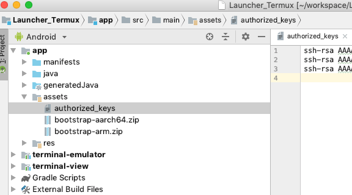

# Run On Android(AArch64)
## Tested Device
|Chipset|Memory Size|GPU Model|Device Model|System|Issue|
|:-----:|:---------:|:-------:|:----------:|:----:|:---:|
|Rockchip RK3399|4GB|Mali-T760 MP4|H96 MAX|Android 7.1.2||
|Rockchip RK3399|4GB|Mali-T760 MP4|Rockpro64|Android 7.1.2||
|Samsung Exynos 7420|3GB|Mali-T760 MP8|VR on avl7420|Android 6.0.1||
|Samsung Exynos 7420|3GB|Mali-T760 MP8|SM-G920A|Android 7.0||
|MediaTek MT6797|3GB|Mali-T880 MP4|Chuwi Hi9 Pro Tablet|Android 8.0.0|[TfLite Object Detection](https://github.com/SharpAI/DeepCamera/issues/19)|
|HiSilicon Kirin 970|4GB|Mali-G72 MP12 + NPU|Huawei Honor 10|Android 8.1.2|[TfLite Object Detection](https://github.com/SharpAI/DeepCamera/issues/19)|

## Get Launcher_Termux source code
```
git clone https://github.com/SharpAI/Launcher_Termux
```

## Config authorized_keys for ssh
Open Launcher_Termux, add your id_rsa.pub in authorized_keys



## Launch Launcher_Termux in Android Studio

## Install openssh in Launcher_Termux

```
pkg install openssh
sshd
```

## Remote access to Launcher_Termux through ssh

```
ssh -p 8022 a@Android_IP
```

## Install development rootfs(Launcher_Termux ssh environment)

```
pkg update
pkg install wget
cd /data/data/com.termux/files
wget https://github.com/SharpAI/DeepCamera/releases/download/1.1/usr_aarch64_dev_0318_2019.tgz
tar -zxf usr_aarch64_dev_0318_2019.tgz
```
#### you can delete usr_aarch64_dev_0318_2019.tgz to save space or just keep it

## Test if working

### please report issue if you have runtime warning
```
LD_LIBRARY_PATH=/system/lib64:$LD_LIBRARY_PATH:$PREFIX/lib64:/system/vendor/lib64/egl:/system/vendor/lib64 python2

import tvm
```
```
>>> tvm.__version__
'0.5.dev'
```
### please report issue if you have runtime warning
```
LD_LIBRARY_PATH=/system/lib64:$LD_LIBRARY_PATH:$PREFIX/lib64 python2

import mxnet
```
```
>>> mxnet.__version__
'1.3.1'
```
## Get the source code of DeepCamera
```
cd
git clone https://github.com/SharpAI/DeepCamera
cd DeepCamera
./setup.sh
cd build
./build_aarch64.sh ./
```

## Install the built code

```
cd DeepCamera/build
tar -zxmf sharpai-app-aarch64.tgz -C ~
```

## Run the built code

```
cd /data/data/com.termux/files/home/runtime
termux-wake-lock
setsid bash ~/runtime/start_aarch64.sh
```
