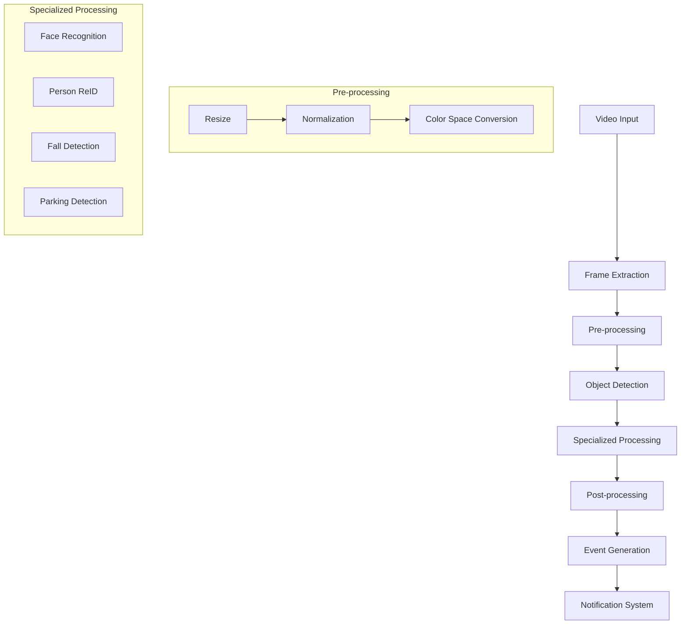

# DeepCamera Pipeline

## Overview
The DeepCamera pipeline is a sophisticated system that processes video streams in real-time for various AI-powered detection and recognition tasks. This document explains the complete pipeline from video input to event notification.

## Pipeline Architecture



## Pipeline Components

### 1. Video Input
- Supports multiple input sources:
  - RTSP streams
  - HTTP streams
  - Local camera devices
  - Video files
- Handles multiple streams concurrently
- Automatic reconnection on stream failure

### 2. Frame Extraction
- Efficient frame sampling
- Frame rate adjustment
- Buffer management
- Frame quality assessment

### 3. Pre-processing
- Image resizing
- Normalization
- Color space conversion
- Aspect ratio handling
- ROI (Region of Interest) cropping

### 4. Object Detection
- Primary detection using YOLOv5
- Multiple object class support
- Confidence thresholding
- Non-maximum suppression
- ROI filtering

### 5. Specialized Processing

#### Face Recognition Pipeline
1. Face detection (RetinaFace)
2. Face alignment
3. Feature extraction (ArcFace)
4. Feature matching
5. Identity verification

#### Person ReID Pipeline
1. Person detection
2. Feature extraction (OSNet)
3. Track association
4. Cross-camera matching

#### Fall Detection Pipeline
1. Person detection
2. Pose estimation
3. Fall event analysis
4. Alert generation

#### Parking Detection Pipeline
1. Parking space definition
2. Vehicle detection
3. Space occupancy analysis
4. State change detection

### 6. Post-processing
- Result filtering
- Event aggregation
- Data formatting
- Metadata enrichment

### 7. Event Generation
- Event classification
- Priority assignment
- Duplicate detection
- Event correlation

### 8. Notification System
- Multiple notification channels:
  - Home Assistant events
  - Webhooks
  - MQTT messages
  - Push notifications
- Event persistence
- Rate limiting

## Data Flow

### Input Processing
```
Video Stream → Frame Buffer → Pre-processing Queue → Detection Queue
```

### Detection Flow
```
Detection Queue → Object Detection → Specialized Processing → Event Generation
```

### Output Flow
```
Event Generation → Event Queue → Notification System → External Systems
```

## Performance Optimization

### Pipeline Optimizations
1. **Parallel Processing**
   - Multi-threading for frame extraction
   - GPU acceleration for detection
   - Asynchronous event handling

2. **Memory Management**
   - Frame buffer optimization
   - Batch processing
   - Resource pooling

3. **Load Balancing**
   - Dynamic frame rate adjustment
   - Priority queue management
   - Resource allocation

### Hardware Utilization
- GPU acceleration
- CPU optimization
- Memory usage control
- Disk I/O management

## Configuration Options

### Pipeline Settings
```yaml
pipeline:
  input:
    frame_rate: 10
    buffer_size: 30
    quality_threshold: 0.8
  
  processing:
    batch_size: 4
    gpu_memory: 2GB
    thread_count: 4
    
  output:
    event_buffer: 100
    notification_rate: 1
```

### Model Settings
```yaml
models:
  detection:
    confidence: 0.4
    nms_threshold: 0.5
    
  recognition:
    face_confidence: 0.9
    reid_threshold: 0.7
```

## Error Handling

### Recovery Mechanisms
1. Stream reconnection
2. Model reloading
3. Memory cleanup
4. Error logging

### Monitoring
- Pipeline health checks
- Performance metrics
- Resource utilization
- Error tracking

## Integration Points

### Input Integration
- Camera systems
- NVR systems
- Video management systems

### Output Integration
- Home Assistant
- Custom webhooks
- Database systems
- Cloud services

## Future Enhancements
1. Dynamic pipeline configuration
2. Advanced scheduling
3. Improved error recovery
4. Enhanced monitoring
5. Additional AI models

For detailed implementation examples and configuration options, please refer to our [Configuration Guide](configuration_guide.md). 